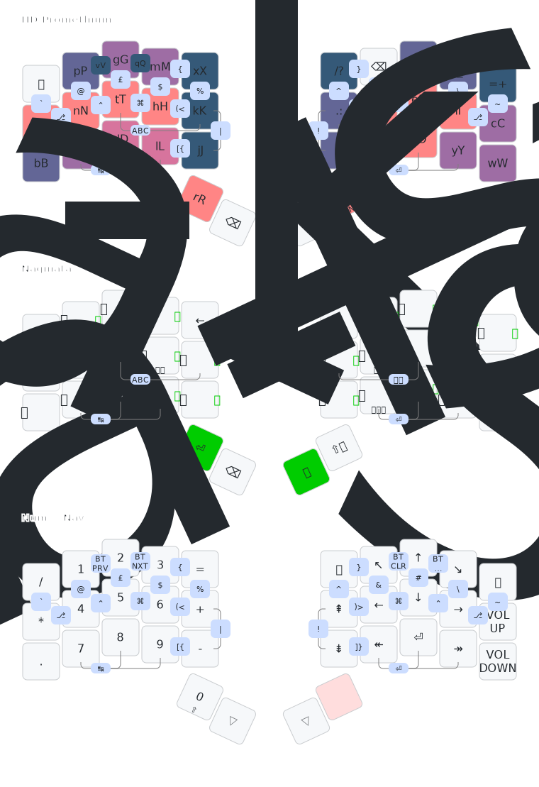

# Peter's personal ZMK keyboard firmware configurations

This repository is where I keep my personal [ZMK keyboard firmware](https://zmk.dev/)
configuration/layouts (generally for keyboard PCBs that I designed and provide
[default firmware](https://github.com/peterjc/zmk-keyboard-graph-theory/) for),
for use with programable mechanical computer keyboards.
The keymap images are rendered automatically using [keymap-drawer](https://github.com/caksoylar/keymap-drawer)
using this [Draw Keymaps GitHub Action](.github/workflows/draw-keymaps.yml).

My base layer is the inverted [Hands Down Promethium
layout](https://www.reddit.com/r/KeyboardLayouts/comments/1g66ivi/hands_down_promethium_snth_meets_hd_silverengram/)
with my personal modifications ("Pico Mod") intended to help with some readline shortcuts
(horizontal pair `B`/`F` for back/forward, vertical pair `P`/`N` for previous/next).
It also has matching `B` (bottom left) and `W` (bottom right) for back to start of word, and
forward to start of next word in Vim or Helix.
Most of the symbols are 2-key vertical combos, the brackets are 2-key horizontal combos
(open on the left hand, close on the right). There is a single combined numbers and navigation
layer accessed by holding the right thumb.
I wanted to be able to use this on my laptop too - achieved with [custom Karabiner-Elements
rules](https://codeberg.org/peterjc/kana-chording-ke/src/branch/main/hands-down-on-jis-macbook)
(see this [blog post](https://blastedbio.blogspot.com/2025/05/what-have-you-done-to-your-keyboard.html)).

The second layer is for typing in Japanese using Naginata Style (薙刀式) (see
[blog post](https://astrobeano.blogspot.com/2025/08/naginata-style-for-typing-in-japanese.html))
using the [ZMK Naginata module](https://github.com/eswai/zmk-naginata). I have
made minor changes so that Qwerty `Q` is now Escape on tap, small on hold, and
added shift-space on a thumb for kanji selection without needing editing layers.
Due to my brackets combos clashing with the default way to switch Japanese mode
and the Naginata layer on and off, those are Qwerty `D`+`G` (labelled 'ABC' in
the image) and Qwerty `H`+`K` instead (labelled 'かな'). This layout uses a *lot*
of chording, but these are not defined as ZMK combos, and so are not drawn here.

## Split 3x5_3 aka 33333+3 Layout with 36 keys

The QMK project uses the term `split_3x5_3` for one of their standard community
layout names for the most common 36 key layouts. This means a symmetrical split
layout where each hand has three rows and five columns (the index finger gets
an extra inner column), plus three thumb keys.

In this keymap image the base layer keys and space are coloured by usage frequencies (orange/pink
for highest use - mainly home keys, down through pink, purples, to a dark blue for low like the
letters demoted to combos: Q, Z, and V).

### Gamma Omega TC36K

The ZMK keymap in file [tc36k.keymap](config/tc36k.keymap) is the split 3x5_3
layout described above (without the bluetooth combos) for the self-built
[Gamma Omega TC36K](https://github.com/unspecworks/gamma-omega/tree/main/tc36k).
This is a single PCB no-diode variant of the Gamma Omega where [I designed the
wiring and PCB](https://astrobeano.blogspot.com/2025/08/my-first-self-built-computer-keyboard.html).

This uses my [ZMK firmware for the TC36K](https://github.com/peterjc/zmk-keyboard-graph-theory/tree/main/boards/shields/tc36k)
(I also wrote [QMK firmware for the TC36K](https://github.com/peterjc/qmk_userspace/tree/main/keyboards/tutte_coxeter_36k)).

This keyboard has 6-key roll-over, which is not a limitation with this or most keymaps.

### Gamma Omega Hesse

The ZMK keymap in file [hesse.keymap](config/hesse.keymap) is the
split 3x5_3 layout described above for the self-built
[Gamma Omega Hesse](https://github.com/unspecworks/gamma-omega/tree/main/tc36k).
This is a Bluetooth version of the Gamma Omega.

This uses my [ZMK firmware for the Hesse](https://github.com/peterjc/zmk-keyboard-graph-theory/tree/main/boards/shields/hesse)

This keyboard has only 4-key roll-over, which was kept in mind when editing this
keymap. i.e. I try not to use any combos needing more than four keys in total.

## Split 3x5_2 aka 33333+2 Layout with 34 keys

The QMK project uses the term `split_3x5_2` for one of their standard community
layout names for the most common 34 key layouts. This means a symmetrical split
layout where each hand has three rows and five columns (the index finger still
gets a full extra inner column), plus two thumb keys.

My layout here is the 3x5_3 layout above with the most tucked thumb keys
discarded (being the least comfortable for me on my 36-key keyboards). This
is done via the `LAYER_FROM36` macro idea from [Cem Aksoylar's ZMK
config](https://github.com/caksoylar/zmk-config),

### Forager Acid

The ZMK keymap in file [acid.keymap](config/hesse.keymap) is the split 3x5_2
layout described above for my self-built variant of the Forager keyboard.

The Forager Acid keyboard has only 4-key roll-over per hand (so better than
the Hesse mentioned above).

## Split 33332+2 Layout with 32 keys

By this I mean a layout where each hand gets columns of 3 keys for the pinky,
ring, middle, and index fingers - but then only 2 keys for the index finger's
inner column, and two thumb keys. This is used by the keyboards like the
[Visorbearer](https://github.com/carrefinho/visorbearer).

For this I drop my `X` and `/` (slash) keys. Note the `X` combo bottom left.

TODO: Resolve how to type `/` and `?`.

### Bivvy16D

The ZMK keymap in file [bivvy16d.keymap](config/bivvy16D.keymap) uses the split
33332+2 layout described here plus navigation and cursors on the two 5-way
navigation buttons.

The Bivvy16D has 14-key roll-over excluding the navigation buttons, 4-key roll
over when they are included. This is much better than the Hesse mentioned above.

## Split 33332+3 Layout with 34 keys

By this I mean a layout where each hand gets columns of 3 keys for the pinky,
ring, middle, and index fingers - but then only 2 keys for the index finger's
inner column, and three thumb keys. So same as the above but with more thumb
keys.

### Bivouac34

The ZMK keymap in file [bivouac34.keymap](config/bivouac34.keymap) uses the split
33332+3 layout described here.

## Split 23332+2 Layout with 30 keys

By this I mean a layout where each hand gets columns of only 2 keys for the pinky,
but 3 keys for the ring, middle, and index fingers, and again only 2 keys for the
index finger's inner column, and two thumb keys. This is used by the keyboards like
the [Hummingbird](https://github.com/PJE66/hummingbird).

This would mean dropping my `Escape` and `=`/`+` keys and all the combos on them.
Right now that seems challenging.

## Slump layouts - Split 133332+2

My 34-key 'slump' layouts have a 30-key core with one thumb key per hand (shift
and space with Qwerty), and one top corner key per hand (Escape and Backspace
with Qwerty), but the inner column is staggered (or 'slumped') to allow the
bottom key to be a thumb key. This then looks like the Visorbearer style Split
33332+2 Layout with 32 keys with an extra corner key (see above), or Split 133332+2.

### Slump52

This keyboard has the core 34-keys in the Slump style, plus an extra central
thumb key, bottom left modifier key, number pad and cursors. This layout has
2 of the left thumb keys in my 36-key layout, and 3 of the right thumb keys:

The ZMK keymap in file [slump52.keymap](config/slump52.keymap) defines this.
Currently X and slash are moved to the extra outer corner keys.
