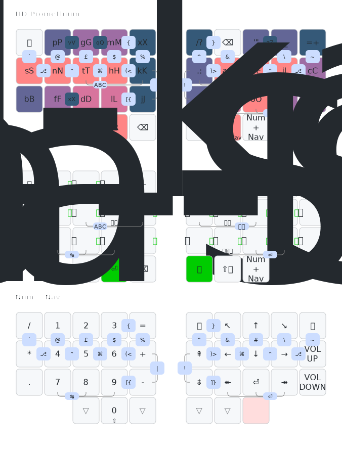

# Peter's personal ZMK keyboard firmware configurations

This repository is where I keep my personal [ZMK keyboard firmware](https://zmk.dev/)
configuration/layouts, for use with programable mechanical computer keyboards.
The keymap images are rendered automatically using [keymap-drawer](https://github.com/caksoylar/keymap-drawer)
using this [Draw Keymaps GitHub Action](.github/workflows/draw-keymaps.yml).

## Split 3x5_3 Layout

The QMK project uses the term `split_3x5_3` for one of their standarr community layout names.
This means a symetrical split layout chere each hand has three rows and five columns (the index
finger gets an extra inner columm), plus three thumb keys.

My base layer is the inverted [Hands Down Promethium
layout](https://www.reddit.com/r/KeyboardLayouts/comments/1g66ivi/hands_down_promethium_snth_meets_hd_silverengram/)
with my personal modifications ("Pico Mod") intended to help with some readline shortcuts.
Most of the symbols are 2-key vertical combos, the brackets are 2-key horizontal combos
(open on the left hand, close on the right). There is a single combined numbers and navigation
layer accessed by holding the right thumb.
I wanted to be able to use this on my laptop too - achieved with [custom Karabiner-Elements
rules](https://codeberg.org/peterjc/kana-chording-ke/src/branch/main/hands-down-on-jis-macbook)
(see this [blog post](https://blastedbio.blogspot.com/2025/05/what-have-you-done-to-your-keyboard.html)).

The second layer is for typing in Japanese using Naginata Style (薙刀式) (see
[blog post](https://astrobeano.blogspot.com/2025/08/naginata-style-for-typing-in-japanese.html))
using the [ZMK Naginata module](https://github.com/eswai/zmk-naginata). I have
made minor changes so that Qwerty `Q` is now Escape on tap, small on hold, and
added shift-space on a thumb for kanji selection without needing editing layers.
Due to my brackets combos clashing with the default way to switch Japanese mode
and the Naginata layer on and off, those are Qwerty `D`+`G` (labelled 'ABC' in
the image) and Qwerty `H`+`K` instead (labelled 'かな'). This layout uses a *lot*
of chording, but these are not defined as ZMK combos, and so are not drawn here.

In this keymap image the base layer keys and space are coloured by usage frequencies (orange/pink
for highest use - mainly home keys, down through pink, purples, to a dark blue for low like the
letters demoted to combos: Q, Z, and V).

### Gamma Omega TC36K

I use the split 3x5_3 layout described above for this 36-key self-built keyboard.

The ZMK keymap in file [tc36k.keymap](config/tc36k.keymap) is for the
[Gamma Omega TC36K](https://github.com/unspecworks/gamma-omega/tree/main/tc36k) 
(a monoblock 'split' keyboard where [I designed the wiring and
PCB](https://astrobeano.blogspot.com/2025/08/my-first-self-built-computer-keyboard.html)) when
used with my [ZMK firmware for TC36K](https://github.com/peterjc/zmk-keyboard-graph-theory/tree/main/boards/shields/tc36k)
(I also wrote [QMK firmware for TC36K](https://github.com/peterjc/qmk_userspace/tree/main/keyboards/tutte_coxeter_36k)).

This keyboard has 6-key roll-over. which is not an issue with this or most keymaps.

### Gamma Omega Hesse

I use the split 3x5_3 layout described above for this 36-key self-built keyboard.

The ZMK keymap in file [hesse.keymap](config/hesse.keymap) is for the
[Gamma Omega Hesse](https://github.com/unspecworks/gamma-omega/tree/main/tc36k)
which is a Bluetooth version of the Gamma Omega, which uses essentially the layout
as the Gamma Omega TC36K above.

This keyboard has only 4-key roll-over, which was kept in mind when editing this
keymap. i.e. I try not to use any combos needing more than four keys in total. 
